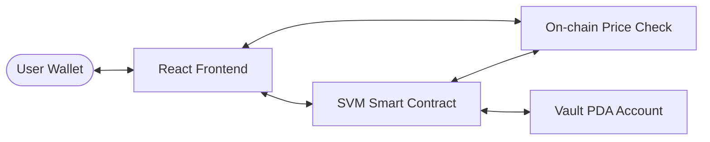
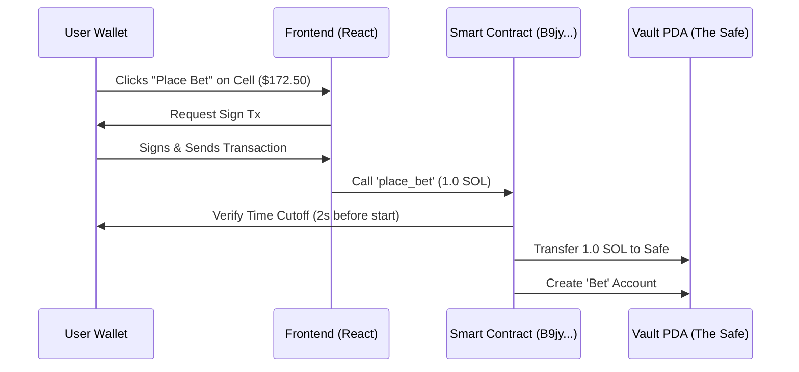
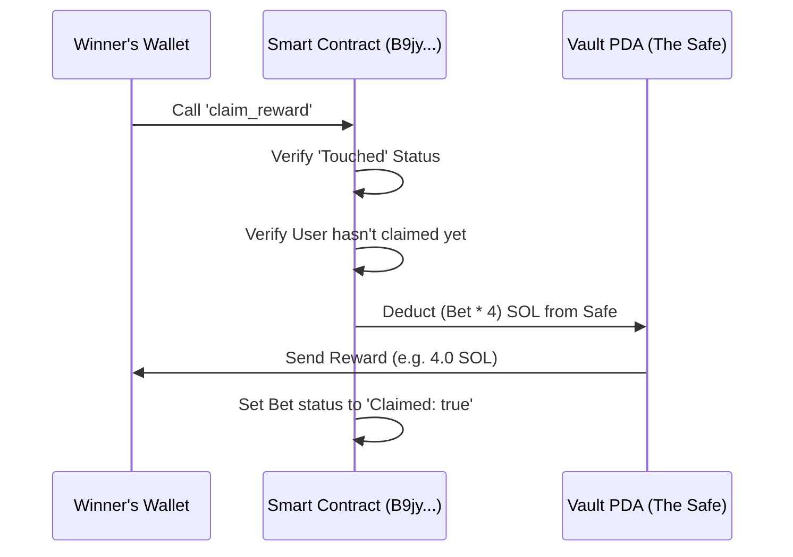

# 📊 GridPredict SVM — Dynamic Price Prediction Game

GridPredict is a high-speed, on-chain price prediction game built on the **Solana Virtual Machine (SVM)** using the **Anchor Framework** and **Pyth Network** oracles. Players predict the price movement of leading crypto assets on a dynamic, rolling grid.

---

## 🏗️ System Architecture

The application consists of three main systems interacting in real-time:



1.  **React Frontend**: Handles the dynamic rendering of the 2D prediction grid and allows users to build transactions.
2.  **SVM Smart Contract (`B9jy...cHj`)**: The "Brain" of the game. It controls betting logic, checks winning conditions, and manages the funds.
3.  **Vault PDA**: A secure "Safe" (Program Derived Address) owned by the contract where user bets are held until they are either won or expired.
4.  **Pyth Oracle**: Provides high-fidelity, sub-second price data for checking the win conditions.

---

## 🔄 Application Flow

### 1. The Betting Flow (Deposit)
When a user predicts a price range (a "Grid Cell"), their SOL is transferred into the **Vault PDA**.



### 2. The Resolution Flow (Win/Loss)
The grid dynamically moves with the price. Every time-step, your program checks if the oracle price has "touched" your predicted cell.

- **Win**: The current price enters the `[priceMin, priceMax]` range during the `[startTime, endTime]` window.
- **Loss**: The time window expires and the price never entered the cell.

### 3. The Claiming Flow (Withdraw)
If you win, the payout is 4x your initial bet. The program calculates the reward and transfers it from the Vault back to your wallet.



---

## 🔥 Key Features

- **🚀 Live Pyth Integration**: Supports high-fidelity data feeds for SOL, BTC, ETH, JUP, and PYTH.
- **🎛️ Dynamic Rolling Grid**: The X-axis (time) and Y-axis (price) automatically shift as market conditions change, so you can always bet close to the current price.
- **⚡ SVM Low Latency**: Faster transactions and sub-second updates using Solana's high-speed architecture.
- **📈 High Precision**: Support for price variations as low as **0.01** using advanced decimal handling.

---

## 🛠️ Project Configuration

- **Program ID**: `5WnkG5k947XrUK1Lcf3bJ7Y31ncRWBFJbL51LyV8sLUh`
- **Network**: Solana Devnet
- **Framework**: Anchor 0.30.1 / Rust 1.75+
- **Frontend**: Vite / React / Tailwind CSS / Shadcn UI

---

## 📦 Getting Started

To run the frontend locally:
```bash
npm install
npm run dev
```

The app will connect to the devnet program and Pyth Hermes service automatically.
